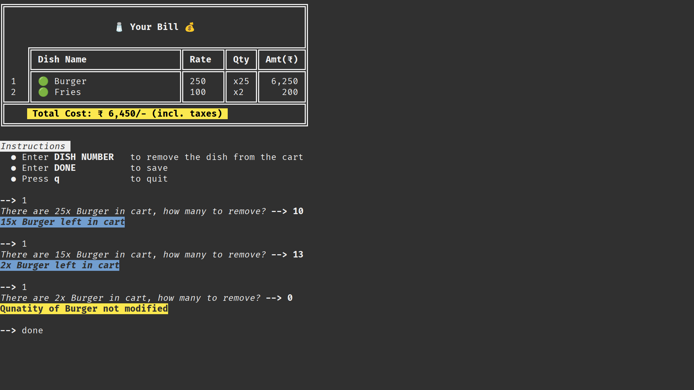

# PPS Project

## Group Details

|       Name        |   SAP ID    | Roll No. |
| :---------------: | :---------: | :------: |
| Prateek Jayaswal  | 70412200052 |   I036   |
| Vedant Maheshwari | 70412200053 |   I051   |

## Problem Statement

> **The objective of the project is to demonstrate a robust programming logic for a menu based ordering system written in c++**

## Project Topic

> **We implemented an extensible food ordering program with features that include drawing tables, adding/deleting dishes from bill with relevant error handling.**

## Abstract

- Handling User Input
  - We created a single function for taking user input across the whole program.
  - The function trims whitespaces from the input and converts the entire input into lowercase.
- A function called stoic() converts string input to integer and returns errCode when any character of the string is not a number.
- A function called comma() takes a string input which is always made up of numbers and adds commas in between them as per the Indian Numbering System.
- Structs 'menu' and 'bill' store the type(veg/nonveg), name, cost and qty of the dish.
- A function date() returns the name of the day of the week which is showed in the banner at the start of the program.
- We create a veg menu map or a non veg menu map depending on the choice of the user. The map members can be extended and easily modified without changing any other code.
- As per the preference of the user the relevant menu is printed in the form of a table.
- The user can add items to a cart by entering the dish number from the table.
  - The user cannot checkout with an empty cart.
  - If dish already added before, we update its quantity otherwise we create a new entry in the cart.
- The user can delete items from the cart by entering the dish number from the table.
  - if only one item is in the cart, directly ask the quantity of dishes to be removed from the cart.
  - inform user if the item has already has been removed by matching history.
  - if the quantity of the dish is one, then directly remove it otherwise ask for the quantity of the dishes to be removed.
  - exit if user removes all the items from the cart.

<br/>

## Tech Used

- Markdown
- Github
- VSCode
- Linter
- [Rang](https://github.com/agauniyal/rang)

## Algorithm

1. START
2. DISPLAY WELCOME MESSAGE
3. INPUT MENU CHOICE
4. DISPLAY RELEVANT MENU
5. USER ENTERS ITEM NUMBER AND QUANTITY
6. ENTERED ITEMS AND QUANTITY ARE ADDED TO CART
7. USER WANTS TO DELETE ITEMS?
8. If yes
9. ENTER ITEMS AND QUANTITY USER WANTS TO DELETE
10. DELETE ITEMS AND QUANTITY FROM CART
11. DISPLAY BILL
12. If no
13. go to step 11
14. STOP

## Flowchart


<br/>

## Complete Code

```cpp
#include "rang.hpp" // for text coloring and formatting
using namespace rang;

#include <iostream>
#include <string>
#include <ctime> // to show current day of the week in greet()
#include <map>
using namespace std;

const int errCode = -2147483647;

// #### SHORT & REUSABLE FUNCTIONS STARTED ####
void clearScr()
{
    // This is an ANSI Escape Code. It tells the console to flush the screen and reset the cursor. src:https://stackoverflow.com/a/32008479
    cout << "\033[2J\033[1;1H";
}
void hideCursor() // src:https://stackoverflow.com/a/55313602
{
    cout << "\e[?25l";
}
void showCursor() // src:https://stackoverflow.com/a/55313602
{
    cout << "\e[?25h";
}
void quit()
{
    clearScr();
    cout << style::blink << "☺️  " << style::reset << style::bold << "Thanks for visiting us, do come back later" << style::reset << style::blink << " ☺️" << style::reset << endl;
    showCursor();
    exit(0); // stop program with exit code = 0, i.e. program stopped without any crashes
}
void crash(string loc) // for debugging crashes and locating the function which caused unexpected behaviour
{
    cout << style::bold << rang::fg::red << style::reversed << "The program encountered unexpected behaviour at " << loc << style::reset << "\n\n";
    exit(404);
}
string trimmer(string x) // remove leading and trailing spaces src:https://stackoverflow.com/a/49959751
{
    if (x[0] == ' ')
    {
        x.erase(0, 1);
        return trimmer(x);
    }
    if (x[x.length() - 1] == ' ')
    {
        x.erase(x.length() - 1, x.length());
        return trimmer(x);
    }
    else
        return x;
}
string fetchVar() // function for normalizing all inputs
{
    string str;
    hideCursor();
    getline(cin, str); // cin breaks at whitespace, this doesn't
    return trimmer(str);
}
string lowerCaser(string str) // returns string in lower case
{
    for (int i = 0; i < str.length(); i++)
        str[i] = tolower(str[i]);
    return str;
}
int stoic(string snum) // converts string to int. Similar func available in STL, but needs try-catch. Pun intended(stoicism)
{
    int ctr = 1, num = 0;
    for (int i = snum.length() - 1; i >= 0; i--)
        if ((int)(snum.at(i)) >= 48 && (int)(snum.at(i)) <= 57) // checks if char is a number
        {
            int dig = (int)(snum.at(i)) - 48;
            num += dig * ctr;
            ctr *= 10;
        }
        else
            return errCode;
    return num;
}
string isItVeg(string checkDish)
{
    if (checkDish == "veg")
        return "🟢";
    else if (checkDish == "nonveg")
        return "🔴";
    else
        crash("isItVeg(), probably mispelled the word veg/nonveg for a 'type' member of struct menu");
    return "";
}
string comma(string s) // thanks @Vedant
{
    int l = s.length(); // calculates length of string
    if (l <= 3)
        return (s);                       // returns string as it is if less than 1000
    string s2 = "," + s.substr(l - 3, 3); // extracts last 3 digits , adds comma in front and stores it in a new string
    s = s.substr(0, l - 3);               // stores original number after above extraction
    int n = s.length();                   // length of string after above extraction
    if (l % 2 == 1)                       // groups 2 digits together,extracts them, adds a comma,puts new string in front of previously extracted digits
    {
        while (n)
        {
            s2 = "," + s.substr(n - 2, 2) + s2;
            s = s.substr(0, n - 2);
            n = s.length();
        }
        return (s2.substr(1, s2.length()));
    }
    while (n > 1)
    {
        s2 = "," + s.substr(n - 2, 2) + s2;
        s = s.substr(0, n - 2);
        n = s.length();
    }
    return (s + s2);
}
// #### SHORT & REUSABLE FUNCTIONS OVER ####

// struct is a set of properties for one dish and maps are a set of dishes with their own unique set of properties
struct menu
{
    string type;
    string name;
    int cost;
};
struct bill
{
    string type;
    string name;
    int cost;
    int qty;
};

char *date() // returns current day of the week, depends on <ctime>. Returns pointer to variable date which is an array of chars which is a string
{
    // creating variables using structs defined under <ctime>
    time_t curr_time;
    tm *curr_tm;

    // date is static, so that it can be returned. src:method 2 on https://www.geeksforgeeks.org/how-to-return-a-local-array-from-a-cpp-function/
    static char date[100];

    // stores current date+time at location of variable curr_tm
    time(&curr_time);                // store time at curr_time
    curr_tm = localtime(&curr_time); // localize the time and store it in curr_tm

    // format curr_tm to show only day of the week and store it inside variable date
    strftime(date, 50, "%A", curr_tm);
    return date;
}
void greet()
{
    cout << rang::bgB::yellow << rang::fgB::red;
    cout << "                                                                               " << endl;
    cout << "  ██╗    ██╗ ███████╗ ██╗       ██████╗  ██████╗  ███╗   ███╗ ███████╗    ██╗  " << endl;
    cout << "  ██║    ██║ ██╔════╝ ██║      ██╔════╝ ██╔═══██╗ ████╗ ████║ ██╔════╝    ██║  " << endl;
    cout << "  ██║ █╗ ██║ █████╗   ██║      ██║      ██║   ██║ ██╔████╔██║ █████╗      ██║  " << endl;
    cout << "  ██║███╗██║ ██╔══╝   ██║      ██║      ██║   ██║ ██║╚██╔╝██║ ██╔══╝      ╚═╝  " << endl;
    cout << "  ╚███╔███╔╝ ███████╗ ███████╗ ╚██████╗ ╚██████╔╝ ██║ ╚═╝ ██║ ███████╗    ██╗  " << endl;
    cout << "   ╚══╝╚══╝  ╚══════╝ ╚══════╝  ╚═════╝  ╚═════╝  ╚═╝     ╚═╝ ╚══════╝    ╚═╝  " << endl;
    cout << "                                                                               \n\n"
         << style::reset;
    char *today;
    today = date();
    cout << style::blink << "\t\t\t🎊️ " << style::reset << style::italic << rang::fgB::blue << style::bold << today << style::reset << style::italic << rang::fgB::blue << " Exclusive Offers! " << style::reset << style::blink << "🎊️\n\n"
         << style::reset;
    cout << style::italic << rang::fgB::blue << "\t\tEnjoy discounts on all our dishes every " << style::bold << today << style::reset << style::italic << rang::fgB::blue << "!" << style::reset << "\n\n";
}

int userInputHandler01() // yes/no/q
{
    cout << style::bold << style::blink << "--> " << style::reset;
    string choice = lowerCaser(fetchVar());
    if (choice == "yes")
        return 1;
    else if (choice == "no")
        return 2;
    else if (choice == "q")
        quit();
    else
        cout << style::bold << rang::fgB::red << style::reversed << "Invalid Input!\n\n"
             << style::reset;
    return 0;
}

// creating 2 maps with int as key and struct menu as value
map<int, menu> setMenuVeg()
{
    // src:https://www.geeksforgeeks.org/c-map-key-user-define-data-type/
    map<int, menu> vegMenu;
    vegMenu[1] = {"veg", "Burger", 250};
    vegMenu[2] = {"veg", "Fries", 100};
    vegMenu[3] = {"veg", "Pizza", 350};
    vegMenu[4] = {"veg", "Sandwich", 150};
    vegMenu[5] = {"veg", "Soup", 200};
    vegMenu[6] = {"veg", "Noodles", 350};
    vegMenu[7] = {"veg", "Curry", 300};
    vegMenu[8] = {"veg", "Rice", 250};
    // vegMenu[9] = {"veg", "<Name>", <Cost>};
    return vegMenu; // src:https://stackoverflow.com/a/50146252
}
map<int, menu> setMenuNonVeg()
{
    map<int, menu> nonVegMenu = setMenuVeg(); // inherit the veg menu in non veg menu
    int vegLen = nonVegMenu.size();           // store the last key of veg menu src:https://www.tutorialspoint.com/map-size-in-cplusplus-stl
    // append non veg dishes:
    nonVegMenu[vegLen + 1] = {"nonveg", "Chicken Burger", 300};
    nonVegMenu[vegLen + 2] = {"nonveg", "Chicken Wings", 200};
    nonVegMenu[vegLen + 3] = {"nonveg", "Chicken Pizza", 400};
    nonVegMenu[vegLen + 4] = {"nonveg", "Chicken Sandwich", 200};
    nonVegMenu[vegLen + 5] = {"nonveg", "Chicken Curry", 350};
    return nonVegMenu; // src:https://stackoverflow.com/a/50146252
}
map<int, menu> decideMenu(string name)
{
    while (true)
    {
        cout << style::italic << rang::fg::magenta << rang::bgB::gray << style::reversed << " " << name << ", Are you Vegetarian? Answer with 'yes' / 'no', Press 'q' to quit " << style::reset << endl;
        int choice = userInputHandler01();
        if (choice == 1)
            return setMenuVeg();
        else if (choice == 2)
            return setMenuNonVeg();
    }
}
void printMenu(map<int, menu> menumap) // CAUTION : very large dish name COULD break alignment but wont crash() :(
{
    cout << "╔═══════════════════════════════════════╗" << endl;
    cout << "║                                       ║" << endl;
    cout << "║            " << style::blink << "🤤" << style::reset << style::bold << " Our Menu " << style::reset << style::blink << "🤤" << style::reset << "             ║" << endl;
    cout << "║                                       ║" << endl;
    cout << "║    ╔══════════════════════════╦═══════╣" << endl;
    map<int, menu>::iterator i;
    for (i = menumap.begin(); i != menumap.end(); i++)
    {
        if ((*i).first < 10)                    // align dish number
            if ((*i).second.name.length() < 11) // align dish name
                cout << "║ " << (*i).first << "  ║ " << isItVeg((*i).second.type) << "  " << (*i).second.name << " \t\t║ ₹ " << (*i).second.cost << " ║";
            else
                cout << "║ " << (*i).first << "  ║ " << isItVeg((*i).second.type) << "  " << (*i).second.name << " \t║ ₹ " << (*i).second.cost << " ║";
        else if ((*i).second.name.length() < 11) // align dish number & name
            cout << "║ " << (*i).first << " ║ " << isItVeg((*i).second.type) << "  " << (*i).second.name << " \t\t║ ₹ " << (*i).second.cost << " ║";
        else
            cout << "║ " << (*i).first << " ║ " << isItVeg((*i).second.type) << "  " << (*i).second.name << " \t║ ₹ " << (*i).second.cost << " ║";
        cout << "\n";
    }
    cout << "╚════╩══════════════════════════╩═══════╝\n\n";
}

void wannaBuy(string name)
{
    while (true)
    {
        cout << style::italic << rang::fg::magenta << rang::bgB::gray << style::reversed << " " << name << ", Do you want to order anything from our menu? Answer with 'yes' / 'no', Press 'q' to quit " << style::reset << endl;
        int choice = userInputHandler01();
        if (choice == 1)
            break;
        else if (choice == 2)
            quit();
    }
}

int userInputHandler02(int lim) // done/q/<+ve int less than len of menumap>
{
    cout << style::bold << style::blink << "--> " << style::reset;
    string choice = lowerCaser(fetchVar());
    if (choice == "done")
        return 1;
    else if (choice == "q")
        quit();
    else
    {
        int num = stoic(choice);
        if (num == errCode || num == 0)
        {
            cout << style::bold << rang::fgB::red << style::reversed << "Invalid Input!\n\n"
                 << style::reset;
            return 0;
        }
        if (num > lim)
        {
            cout << style::bold << rang::fgB::red << style::reversed << choice << " is out of range!\n\n"
                 << style::reset;
            return 0;
        }
        return num + 1234; // adding 1234 coz item 1 might be interpreted as DONE
    }
    return 0;
}

int userInputHandler03() //<int grtr than/equal to 0 and less than 100>
{
    string choice = fetchVar();
    int num = stoic(choice);
    if (num == errCode)
    {
        cout << style::bold << rang::fgB::red << style::reversed << choice << " is an invalid input!\n\n"
             << style::reset;
        return 0;
    }
    if (num > 99)
    {
        cout << style::bold << rang::fgB::red << style::reversed << "Maximum 99 dishes per person!\n\n"
             << style::reset;
        return 0;
    }
    return num + 1234; // adding 1234 coz 0 might be misinterpreted
}

map<int, bill> takeOrder(map<int, menu> menumap)
{
    map<int, bill> billmap;
    cout << style::italic << style::reversed << " Instructions: " << style::reset << endl;
    cout << "  ● Enter " << style::bold << "DISH NUMBER" << style::reset << "\tto add the dish to the cart" << endl;
    cout << "  ● Enter " << style::bold << "DONE" << style::reset << "\t\tto checkout" << endl;
    cout << "  ● Press " << style::bold << "q" << style::reset << "\t\tto quit\n\n"
         << style::reset;
    while (true)
    {
        int choice = userInputHandler02(menumap.size());
        if (choice == 0)
            continue;
        if (choice == 1)
            if (billmap.size() != 0) // dont checkout with empty cart
                return billmap;
            else
                cout << style::bold << rang::fgB::red << style::reversed << "Cart is empty!, add something or press 'q' to quit\n\n"
                     << style::reset;
        else
        {
            choice -= 1234; // remove magic
            int howMany;
            while (true)
            {
                cout << style::italic << "How many " << menumap.at(choice).name << " do you want? " << style::reset << style::bold << "--> " << style::reset;
                howMany = userInputHandler03();
                if (howMany == 0)
                    continue;
                howMany -= 1234; // remove magic
                break;
            }
            bool skipflag = false;
            map<int, bill>::iterator i;
            for (i = billmap.begin(); i != billmap.end(); i++)
                if ((*i).second.name == menumap.at(choice).name) // if item already in bill, dont create new entry
                {
                    if (howMany == 0)
                    {
                        cout << style::bold << rang::fgB::yellow << style::reversed << menumap.at(choice).name << " was not added to cart, already " << billmap.at(choice).qty << " in cart\n\n"
                             << style::reset;
                        skipflag = true;
                        break;
                    }
                    if (howMany + (*i).second.qty > 99)
                    {
                        cout << style::bold << rang::fgB::red << style::reversed << "Maximum 99 dishes per person!\n\n"
                             << style::reset;
                        skipflag = true;
                        break;
                    }
                    (*i).second.qty += howMany;
                    (*i).second.cost = (*i).second.qty * menumap.at(choice).cost;
                    cout << rang::fgB::blue << style::reversed << "Added " << howMany << " " << menumap.at(choice).name << " in cart, now " << (*i).second.qty << " in cart\n\n"
                         << style::reset;
                    skipflag = true;
                    break;
                }
            if (skipflag)
                continue;
            if (howMany != 0) // create new entry if item not in bill already and howmany =/= 0
            {
                billmap[billmap.size() + 1] = {menumap.at(choice).type, menumap.at(choice).name, (menumap.at(choice).cost * howMany), howMany};
                cout << style::italic << rang::fgB::blue << style::reversed << "Added " << howMany << " " << menumap.at(choice).name << " to cart\n\n"
                     << style::reset;
            }
            else if (howMany == 0) // dont create new entry if item not in bill already but howmany==0
                cout << style::bold << rang::fgB::yellow << style::reversed << menumap.at(choice).name << " was not added to cart\n\n"
                     << style::reset;
        }
    }
}

int printBill(map<int, bill> billmap)
{
    int total;
    map<int, bill>::iterator i;
    cout << "╔═══════════════════════════════════════════════════════╗" << endl;
    cout << "║                                                       ║" << endl;
    cout << "║                    " << style::blink << "🧂" << style::reset << style::bold << " Your Bill " << style::reset << style::blink << "💰" << style::reset << "                    ║" << endl;
    cout << "║                                                       ║" << endl;
    cout << "║    ╔═══════════════════════════╦═══════╦═════╦════════╣" << endl;
    cout << "║    ║ " << style::bold << "Dish Name" << style::reset << "                 ║ " << style::bold << "Rate" << style::reset << "  ║ " << style::bold << "Qty" << style::reset << " ║ " << style::bold << "Amt(₹)" << style::reset << " ║" << endl;
    cout << "║    ╠═══════════════════════════╬═══════╬═════╬════════╣" << endl;

    // incrementally creating rows as strings by measuring lengths of cells and padding them accordingly
    string print, tab = "\t", sep = "║", ws = " ";
    for (i = billmap.begin(); i != billmap.end(); i++)
    {
        // aligning dish numbers
        if ((*i).first < 10)
            print = sep + ws + to_string((*i).first) + ws + ws + sep + ws + isItVeg((*i).second.type) + ws + (*i).second.name + tab;
        else if ((*i).first >= 10)
            print = sep + ws + to_string((*i).first) + ws + sep + ws + isItVeg((*i).second.type) + ws + (*i).second.name + tab;

        // aligning dish names
        if ((*i).second.name.length() < 5)
            print += tab + tab + ws + sep + ws;
        else if ((*i).second.name.length() <= 13 && (*i).second.name.length() > 5)
            print += tab + ws + sep + ws;
        else if ((*i).second.name.length() > 13)
            print += ws + sep + ws;
        else
            print += tab + tab + ws + sep + ws;

        // aligning rate
        print += to_string((*i).second.cost / (*i).second.qty) + ws + ws + ws + sep + ws;

        print += "x" + to_string((*i).second.qty);

        // aligning dish qty
        if ((*i).second.qty < 10)
            print += ws + ws + sep;
        else if ((*i).second.qty < 100)
            print += ws + sep;

        // aligning dish qty * dish price
        if ((*i).second.cost < 1000)
            print += ws + ws + ws + ws + comma(to_string((*i).second.cost)) + ws + sep;
        else if ((*i).second.cost < 10000)
            print += ws + ws + comma(to_string((*i).second.cost)) + ws + sep;
        else if ((*i).second.cost < 100000)
            print += ws + comma(to_string((*i).second.cost)) + ws + sep;

        cout << print << endl;     // print row by row
        total += (*i).second.cost; // calc total cost while printing
    }

    // formatting last row
    string pad;
    if (total > 99 && total < 1000)
        pad = "                ";
    else if (total > 999 && total < 10000)
        pad = "              ";
    else if (total > 9999 && total < 100000)
        pad = "             ";
    else if (total > 99999 && total < 1000000)
        pad = "           ";
    else if (total > 99999 && total < 1000000)
        pad = "         ";
    cout << "╠════╩═══════════════════════════╩═══════╩═════╩════════╣" << endl;
    cout << "║    " << style::bold << rang::bg::black << rang::fgB::yellow << style::reversed << " Total Cost: ₹ " << comma(to_string(total)) << "/- (incl. taxes) " << style::reset << pad << "║" << endl;
    cout << "╚═══════════════════════════════════════════════════════╝" << endl;
    return total;
}

map<int, bill> letsDel(map<int, bill> billmap, int lim);
map<int, bill> wannaDel(map<int, bill> billmap, int lim, string name)
{
    while (true)
    {
        cout << "\n"
             << style::italic << rang::fg::magenta << rang::bgB::gray << style::reversed << " " << name << ", Do you want to remove anything from your bill? Answer with 'yes' / 'no', Press 'q' to quit " << style::reset << endl;
        int choice = userInputHandler01();
        if (choice == 1)
        {
            billmap = letsDel(billmap, lim);
            clearScr();
            printBill(billmap);
        }
        else if (choice == 2)
            return billmap;
    }
}
int userInputHandler04(int lim)
{
    string choice = fetchVar();
    int num = stoic(choice);
    if (num == errCode || num < 0)
    {
        cout << style::bold << ::fgB::red << style::reversed << "'" << choice << "' is an invalid input!\n\n"
             << style::reset;
        return 0;
    }
    if (num > lim)
    {
        cout << style::bold << rang::fgB::red << style::reversed << choice << " is out of range!\n\n"
             << style::reset;
        return 0;
    }
    return num + 1234; // adding 1234 coz 0 might be misinterpreted
}
map<int, bill> resetKeys(map<int, bill> billmap) // if dishes 2,3,4 are ordered the bill shows them as 1 2 3, if 1 is removed, new bill shows 2 3 instead of 1 2. Fix:
{
    map<int, bill> newbillmap;
    map<int, bill>::iterator i;
    int assign = 1;
    for (i = billmap.begin(); i != billmap.end(); i++, assign++)
        newbillmap[assign] = {(*i).second.type, (*i).second.name, (*i).second.cost, (*i).second.qty};
    return newbillmap;
}
map<int, bill> letsDel(map<int, bill> billmap, int lim)
{
    clearScr();
    printBill(billmap);
    int history[lim], appendCtr = 0, choice = 1, billLen = billmap.size();
    bool skipLoop = false;
    cout << style::italic << style::reversed << "\nInstructions " << style::reset << endl;
    cout << "  ● Enter " << style::bold << "DISH NUMBER" << style::reset << "\tto remove the dish from the cart" << endl;
    cout << "  ● Enter " << style::bold << "DONE" << style::reset << "\t\tto save" << endl;
    cout << "  ● Press " << style::bold << "q" << style::reset << "\t\tto quit\n\n";
    if (billLen == 1)
        goto OnlyOneItemInBill; // when only one dish in the cart, directly ask the qty to be removed
    while (true)
    {
        choice = userInputHandler02(billLen);
        if (choice == 0)
            continue;
        if (choice == 1)
            if (billmap.size() != 0) // proceed only if all items are not removed
                return resetKeys(billmap);
            else
            {
                clearScr();
                cout << style::blink << "😭️ " << style::reset << style::bold << "All Items Removed from cart" << style::reset << style::blink << " 😭️" << style::reset << endl;
                cout << style::blink << "☺️  " << style::reset << style::bold << "Thanks for visiting us, do come back later" << style::reset << style::blink << " ☺️" << style::reset << endl;
                showCursor();
                exit(0);
            }
        else
        {
            choice -= 1234;
            skipLoop = false;
            for (int i = 0; i < lim; i++)
                if (history[i] == choice)
                {
                    cout << style::bold << rang::fgB::yellow << style::reversed << "dish " << choice << " was already removed from the bill, enter 'DONE' to save and print new bill\n\n"
                         << style::reset;
                    skipLoop = true;
                    break;
                }
            if (skipLoop)
                continue;
            if (billmap.at(choice).qty == 1)
            {
                cout << style::italic << rang::fgB::red << style::reversed << billmap.at(choice).name << " removed from cart\n\n"
                     << style::reset;
                history[appendCtr] = choice;
                billmap.erase(choice); // src:https://www.geeksforgeeks.org/map-erase-function-in-c-stl/
                appendCtr++;
            }
            else
                while (true)
                {
                OnlyOneItemInBill:
                    cout << style::italic << "There are " << billmap.at(choice).qty << "x " << billmap.at(choice).name << " in cart, how many to remove? " << style::reset << style::bold << "--> ";
                    int howMany = userInputHandler04(billmap.at(choice).qty);
                    if (howMany == 0)
                        continue;
                    howMany -= 1234;
                    if (howMany == 0)
                        cout << style::bold << rang::fgB::yellow << style::reversed << "Qunatity of " << billmap.at(choice).name << " not modified\n\n"
                             << style::reset;
                    else if (howMany == billmap.at(choice).qty)
                    {
                        cout << style::italic << rang::fgB::red << style::reversed << billmap.at(choice).name << " removed from cart\n\n"
                             << style::reset;
                        history[appendCtr] = choice;
                        billmap.erase(choice); // src:https://www.geeksforgeeks.org/map-erase-function-in-c-stl/
                        appendCtr++;
                    }
                    else
                    {
                        billmap.at(choice).cost -= (billmap.at(choice).cost / billmap.at(choice).qty) * howMany;
                        billmap.at(choice).qty -= howMany;
                        cout << style::italic << rang::fgB::blue << style::reversed << billmap.at(choice).qty << "x " << billmap.at(choice).name << " left in cart\n\n"
                             << style::reset;
                    }
                    break;
                }
        }
    }
}

void asktoPay(int amt)
{
    while (true)
    {
        cout << style::bold << rang::fgB::yellow << rang::bg::black << style::reversed << "\n Proceed to pay ₹" << comma(to_string(amt)) << "? Confirm with 'yes' or 'no', Press 'q' to quit " << style::reset << endl;
        int choice = userInputHandler01();
        if (choice == 1)
            break;
        else if (choice == 2)
            quit();
    }
}

void thankYou()
{
    cout << "\n\n\n\n"
         << rang::fgB::magenta;
    cout << "████████╗ ██╗  ██╗  █████╗  ███╗   ██╗ ██╗  ██╗    ██╗   ██╗  ██████╗  ██╗   ██╗    ██╗" << endl;
    cout << "╚══██╔══╝ ██║  ██║ ██╔══██╗ ████╗  ██║ ██║ ██╔╝    ╚██╗ ██╔╝ ██╔═══██╗ ██║   ██║    ██║" << endl;
    cout << "   ██║    ███████║ ███████║ ██╔██╗ ██║ █████╔╝      ╚████╔╝  ██║   ██║ ██║   ██║    ██║" << endl;
    cout << "   ██║    ██╔══██║ ██╔══██║ ██║╚██╗██║ ██╔═██╗       ╚██╔╝   ██║   ██║ ██║   ██║    ╚═╝" << endl;
    cout << "   ██║    ██║  ██║ ██║  ██║ ██║ ╚████║ ██║  ██╗       ██║    ╚██████╔╝ ╚██████╔╝    ██╗" << endl;
    cout << "   ╚═╝    ╚═╝  ╚═╝ ╚═╝  ╚═╝ ╚═╝  ╚═══╝ ╚═╝  ╚═╝       ╚═╝     ╚═════╝   ╚═════╝     ╚═╝" << style::reset;
}

int main()
{
    clearScr();
    greet();
    cout << style::italic << "\nEnter Your Name" << style::reset << style::bold << " -->" << style::reset << " ";
    string name = fetchVar();
    clearScr();
    greet();
    map<int, menu> menumap = decideMenu(name);
    clearScr();
    printMenu(menumap);
    wannaBuy(name);
    clearScr();
    printMenu(menumap);
    map<int, bill> billmap = takeOrder(menumap);
    clearScr();
    int total = printBill(billmap);
    billmap = wannaDel(billmap, menumap.size(), name);
    clearScr();
    total = printBill(billmap);
    asktoPay(total);
    clearScr();
    printBill(billmap);
    thankYou();
    return 0;
}
```

<br/><br/><br/><br/><br/><br/><br/><br/><br/><br/><br/><br/><br/><br/><br/><br/><br/><br/><br/><br/><br/><br/><br/>

## Screenshots





## Conclusion

> **Thus a interactive food ordering, menu based robust program has been written in c++**
